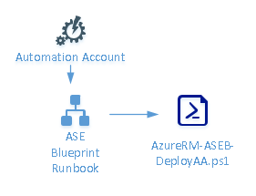
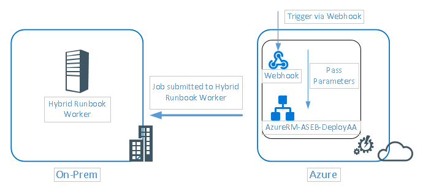

# Blueprints-PaaS-ASE

## Contents
- [1. Solution Overview](#1-solution-overview)
- [2. Solution Design](#2-solution-design)
	- [2.1 Architecture](#21-architecture)
- [3. Deployment](#3-deployment) 
	- [3.1 Installation Prerequisites](#31-installation-prerequisites)
	- [3.2 Deployment Steps Overview](#32-deployment-steps-overview)

## 1. Solution Overview

This Blueprint deploys a fully automated secure baseline Azure ARM Template as described here https://github.com/mayurshintre/Blueprints-PaaS-ASE/tree/master/ase-ilb-blueprint via Azure Automation

## 2. Solution Design

### 2.1 Architecture
The diagram below illustrates the deployment topology and architecture of the solution:

## 3. Deployment Guide

### 3.1 Installation Prerequisites
This solution utilizes a combination of ARM templates and PowerShell. In order to deploy the solution. When deployed to Hybrid Runbook Worker the solution will automatically install the items below: 

+ [Azure Active Directory V2 PowerShell Module](https://technet.microsoft.com/en-us/library/dn975125.aspx#Anchor_5)
+ [Azure Resource Manager PowerShell Module via WebPi Installer](http://go.microsoft.com/fwlink/?LinkId=255386)

### 3.2 Deployment Steps Overview
In order to deploy via Azure Automation you will need to configure several assets utilizing Azure Automation asset store and import required modules

1. Configure required assets
2. Create webhook to programitcally initiate the runbook and pass parameters
3. Create the Azure Deploy runbook to execute the deployment

#### 3.1.1 Configure Asset Variables 
